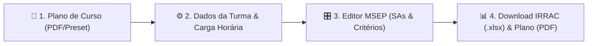

# 🏛️ Docente SENAI (MSEP & IRRAC Suite)

 

**Plataforma Web Inteligente de Engenharia Pedagógica e Automação de Documentos Institucionais SENAI.**  
*Geração automática de Planos de Ensino baseados no MSEP (Metodologia SENAI de Educação Profissional) e exportação da planilha oficial IRRAC (.xlsx) com fórmulas dinâmicas.*

---

## 🎯 Propósito do Projeto

O **Docente SENAI** foi concebido para resolver uma das principais dores operacionais e burocráticas do corpo docente do SENAI: a necessidade de traduzir manualmente matrizes curriculares de **Planos de Curso** em **Situações de Aprendizagem (SAs)** contextualizadas e estruturar a complexa matriz de critérios avaliativos na planilha **IRRAC**.

A plataforma elimina o retrabalho repetitivo, oferecendo uma solução **aberta, ágil, sem necessidade de login, com salvamento local automático (localStorage)** e **100% modular** para todas as áreas tecnológicas da instituição.

---

## 🚀 Principais Funcionalidades

### 1. 🌐 Universal & Multidisciplinar
* **Todas as Áreas Tecnológicas:** Pré-configurações prontas e suporte a qualquer curso de *Tecnologia da Informação*, *Eletroeletrônica*, *Automação Industrial*, *Metalmecânica*, *Refrigeração*, *Gestão*, etc.
* **Carga Horária Flexível:** Ajuste dinâmico para cursos de qualquer duração (*20h, 40h, 60h, 80h, 160h, 200h+*).

### 2. 🎛️ Editor Pedagógico MSEP Modular
* **Situações de Aprendizagem (SAs) Dinâmicas:** Adicione (`+`) ou remova (`🗑️`) SAs conforme a extensão da Unidade Curricular.
* **Balanceador de Horas em Tempo Real:** Medidor visual que valida a equivalência entre as aulas distribuídas nas SAs e a carga horária total do curso.
* **Cenários do Mundo Real:** Geração de narrativas contextualizadas com empresas simuladas, desafios de engenharia e entregáveis práticos.

### 3. 📋 Matriz de Critérios de Avaliação
* **Flexibilidade Total:** Adicione e remova linhas de critérios livremente.
* **Classificação Clara:** Separação entre critérios **Críticos (`C`)** e **Desejáveis (`D`)**.

### 4. 🧮 Compilador OpenXML do IRRAC com Fórmulas Autoajustáveis
* Gera a planilha oficial `.xlsx` com todas as 4 abas institucionais (`Home`, `Cadastro`, `Consolidação` e a aba da `Unidade Curricular`).
* Recalcula dinamicamente os intervalos de linhas e a fórmula de ponderação:
  $$\text{Nota} = \text{ARRED}\left(\left(\text{Críticos} \times \frac{50}{\text{Total Críticos}}\right) + \left(\text{Desejáveis} \times \frac{50}{\text{Total Desejáveis}}\right), 0\right)$$
  garantindo que a pontuação máxima seja sempre **100**, independente da quantidade de critérios avaliados.

### 5. 📄 Documento Oficial Formatado (Plano de Ensino A4)
* Visualizador e gerador de PDF formatado nas normas visuais e tabelas padrão do SENAI-SP, pronto para impressão e envio à coordenação/orientação pedagógica.

---

## 🛠️ Tecnologias Utilizadas

* **Runtime & Backend:** [Node.js](https://nodejs.org/) (Vanilla HTTP Engine + REST API)
* **Manipulação de Planilhas:** Pure JavaScript OpenXML Compiler com [Adm-Zip](https://github.com/cthackers/adm-zip) (100% Cross-Platform / Cloud-Native)
* **Frontend:** HTML5 Semântico, Vanilla JavaScript (SPA State Management)
* **Design & Estilos:** Vanilla CSS moderno com Design Tokens, Glassmorphism, tipografia Google Fonts (*Plus Jakarta Sans* e *JetBrains Mono*) e Estilos de Impressão A4 (`@media print`)
* **Deploy & Cloud:** [Vercel](https://vercel.com/) / [Render](https://render.com/)

---

## 👨‍💻 Autores e Créditos

Desenvolvido com dedicação para a comunidade docente do **SENAI-SP**.

| **Gustavo Feriani** | **Google Antigravity** |
| :---: | :---: |
| 🎓 *Idealização, Engenharia Pedagógica e Docente SENAI-SP* | 🤖 *Pair Programming, Arquitetura de Software & Automação* |
|  |  |

---

  Construído por docentes para docentes. Compartilhe o conhecimento e simplifique a rotina pedagógica! ❤️

